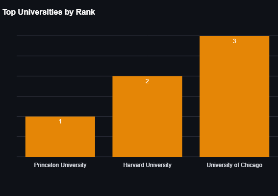

# National University Ranking

# [App Link](https://nur-app.streamlit.app/)

# [View Project Notebook](https://nbviewer.org/github/TelRich/National-University-Ranking-App/blob/nur_main/nur_cleaned.ipynb?flush_cache=True)

---

## National University Rank App

This Python script implements a Streamlit web application called the "National University Rank App." The app is designed to help high school students and prospective college applicants search for and explore information about universities in the United States. It provides various features and functionalities to assist users in making informed decisions about their higher education choices.

### Key Features:

1. **Project Overview**:
   - The app's main goal is to streamline the college search process for students by providing a user-friendly and data-driven platform.

2. **Data Loading and Database Connection**:
   - The script loads university data from a CSV file and connects to a PostgreSQL database for more extensive data access.

3. **Data Visualization**:
   - Utilizes Plotly Express and Graph Objects to create interactive visualizations.
   - Displays top universities by rank and tuition fees.
   - Shows a bar chart of school counts by region.
   - Highlights the oldest universities in the dataset.

4. **Region and State Selection**:
   - Allows users to select their region (Northeast, Midwest, South, West) and state.
   - Displays university rankings and tuition fees specific to the selected region and state.

5. **Power BI Integration**:
   - Embeds Power BI reports and maps to provide additional data insights.

6. **School Recommender** (Work in Progress):
   - A feature under development for recommending universities based on user preferences.

7. **External Links**:
   - Provides links to the project's web app, article, and project outline.

### Usage:

1. Clone the repository and set up the required environment (Streamlit, Plotly, psycopg2, etc.).
2. Load the university data and connect to the PostgreSQL database using the provided functions.
3. Use the Streamlit app to explore university information by region and state.
4. Access Power BI reports and maps for further insights.
5. Stay tuned for the upcoming School Recommender feature.

### External Links:

- [**Project App**](https://nur-app.streamlit.app/): Access the live web app.
- [**Project Notebook**](https://nbviewer.org/github/TelRich/National-University-Ranking-App/blob/nur_main/nur_cleaned.ipynb?flush_cache=True): Read the project article for more details.
- [**Project Outline**](https://github.com/users/TelRich/projects/5): Explore the project outline on GitHub.

---

This code creates an interactive web application designed to simplify the college search process and provide valuable insights to help users make informed decisions about their educational journey.
